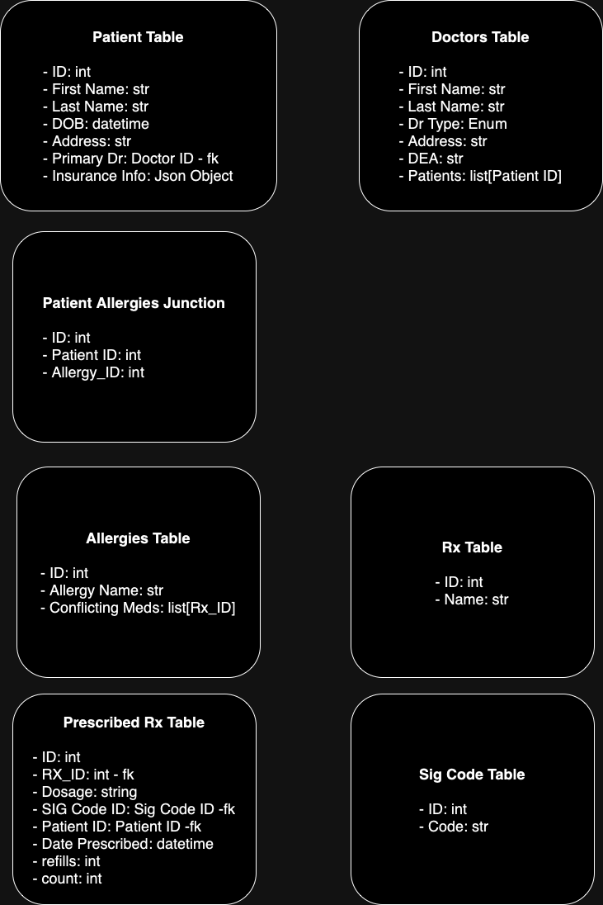

# Project Title

## Overview

Brief description of the project, its purpose, and the problem it aims to solve.

## Goals

- Define the primary goals of the project.
- Outline the expected outcomes and objectives.

## Scope

- Detail what is included in the project.
- Specify what is out of scope to prevent scope creep.

## Out of Scope

## Assumptions

List any assumptions that are being made during the planning and execution of
the project.

## Risks

Identify potential risks and their mitigation strategies.

## Requirements

### Functional Requirements

- Describe the specific actions the system should perform.

### Non-Functional Requirements

- Performance requirements, security standards, compliance needs, etc.

## Architecture/Design Overview

Provide a high-level overview of the proposed architecture or design.

### System Architecture

- Diagrams and descriptions of the overall system architecture.

### Component Design

- Detailed breakdown of key components and their interactions.

## Technology Stack

List the technologies, frameworks, and tools that will be used in the project.

- React
- FastAPI
- PostgreSQL
- AWS

## Development Roadmap

Outline the key milestones and the timeline for the project.

## Testing Strategy

Describe the approach for testing, including unit tests, integration tests, and
any other relevant testing methods.

## Deployment Strategy

Outline the plan for deploying the application, including any staging
environments and rollback plans.

## Maintenance and Monitoring

Describe the strategies for maintaining and monitoring the application
post-launch.

## Open Questions

Discuss any known issues or potential challenges and their possible solutions.

- Generic vs Brand, are they one in the same and treated as such, or treat as
  individual meds.
- What dataset/database to use for drug information preset.
- Do they want to deal with multiple insurances?
- Does the application need HIPPA compliance?

## References

Include any references to external documents, links, or resources that are
relevant to the project.

## Appendices

Add any additional information or documentation relevant to the project.
